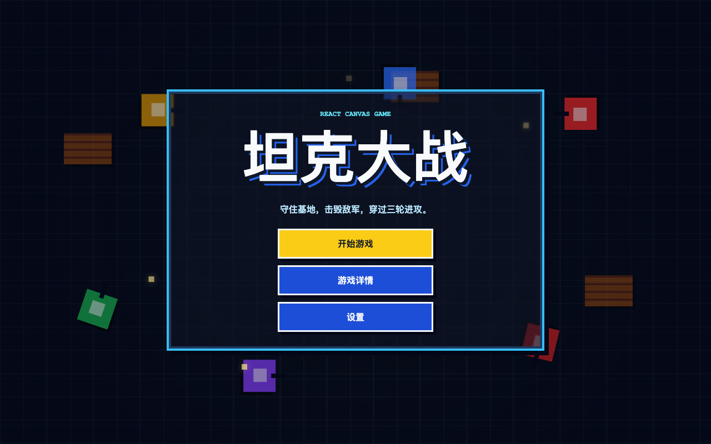

# Tank Battle 🕹️

A pixel-style browser tank battle game built with React and Canvas. Defend your base, destroy enemy tanks, and survive multiple waves on a randomly generated battlefield. 🎮



## Features ✨

- Pixel-art menu with an animated tank battle background
- Canvas-based gameplay loop ⚙️
- Player movement and shooting 💥
- Enemy tank spawning, movement, and firing
- Randomly generated maps for each new game 🧱
- Protected base area with guaranteed outer defenses 🛡️
- Configurable enemy count, tank speed, and bullet speed
- Brick walls, steel walls, score, lives, levels, pause, and restart

## Tech Stack 🧰

- React
- Vite
- HTML Canvas
- CSS animations

## Getting Started 🚀

Install dependencies:

```bash
npm install
```

Start the local development server:

```bash
npm run dev
```

Then open:

```text
http://localhost:5173/
```

## Available Scripts 📜

```bash
npm run dev
```

Runs the game locally with Vite.

```bash
npm run build
```

Builds the project for production into the `dist/` directory.

```bash
npm run preview
```

Serves the production build locally for preview.

## Controls 🎯

- `WASD` or arrow keys: Move
- `Space`: Fire 🔥
- `Enter`: Start or restart after a game ends
- `P`: Pause or resume

## Game Settings ⚙️

Use the **Settings** button on the menu screen to adjust:

- Enemy count
- Tank speed
- Bullet speed

Settings apply when a new game starts.
